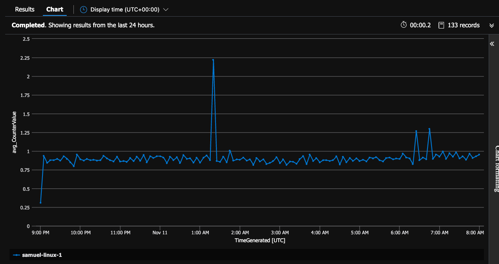

# Introduction

- [Introduction](#introduction)
  - [Prerequisites](#prerequisites)
    - [Azure CLI](#azure-cli)
    - [Powershell](#powershell)
    - [Terraform](#terraform)
    - [Azure CLI Extensions](#azure-cli-extensions)
    - [Powershell Cmdlets](#powershell-cmdlets)
  - [Instructions](#instructions)
    - [Deploy via Terraform](#deploy-via-terraform)
    - [SSH to Linux VM](#ssh-to-linux-vm)
    - [RDP to Windows VM](#rdp-to-windows-vm)
    - [Linux Stress test](#linux-stress-test)
    - [Windows Stress test](#windows-stress-test)
    - [View the CPU Spike](#view-the-cpu-spike)
    - [Useful Commands](#useful-commands)
  - [Unknowns](#unknowns)
    - [References](#references)

## Prerequisites

If on Windows 10 it's recommended to use WSL2 + Ubuntu.

### Azure CLI

- [Install Azure CLI](https://docs.microsoft.com/en-us/cli/azure/install-azure-cli)

### Powershell

This should only be required if you are on a Mac or on LInux.

- [Install Powershell on Mac](https://docs.microsoft.com/en-us/powershell/scripting/install/installing-powershell-on-macos?view=powershell-7.2)

### Terraform

[Install Terraform](https://learn.hashicorp.com/tutorials/terraform/install-cli#install-terraform)

### Azure CLI Extensions

```bash
az extension add --name monitor-control-service
az extension add --name log-analytics
```

### Powershell Cmdlets

\[Optional\] If you want to call Azure Monitor/Compute from Powershell install the following:

```bash
# In Powershell (type pwsh on mac)
Install-Module Az.Monitor
Install-Module Az.Compute
```

## Instructions

### Deploy via Terraform

Edit/create the `deployment/dev.tfvars` with:

```text
windows_vm_count = 2
linux_vm_count = 2
windows_admin_password = "REPLACE_ME"

The above will naturally create two Windows and two Linux VMs.
```

```text
cd deployment
touch dev.tfvars
terraform init
terraform plan --var-file dev.tfvars
terraform apply --auto-approve --var-file dev.tfvars
```

Once applied terraform will output commands for logging into the VMs, see the [deployment/output.tf](deployment/outputs.tf) for reference.

Note that the [deployment/variables.tf](deployment/variables.tf) contains defaults for each required variable except the Windows admin password.

### SSH to Linux VM

```bash
# Replace vmIp with the public IP of the VM
ssh -i ~/.ssh/id_rsa adminuser@vmIp
```

Note: The above ssh command is output as part of terraform output so you can copy and paste from your terminal.  Alternatively to get the ip of the VM use: `az vm list-ip-addresses --name vmName --resource-group ama_test --out table`.

### RDP to Windows VM

The output will contain Powershell commands to RDP into each windows VM, if you lost the output buffer just type `tf output`.

Note that the Powershell command will only work in Windows, not linux or mac.  For mac you'll need to download the `rdp` file form the Azure Portal for the VM itself.

### Linux Stress test

For each Linux VM you can ssh in and type:

```bash
stress --cpu 2 --timeout 60
```

### Windows Stress test

There are no good reputable packages for CPU stress testing from the command line that can be automated with Terraform.  The best recommendation here is to RDP into the Windows VMs, download and install [CpuStres](https://docs.microsoft.com/en-us/sysinternals/downloads/cpustres) and execute a stress test manually.

### View the CPU Spike

First let's verify we can execute a query against the workspace:

```bash
az monitor log-analytics query -w "$(az monitor log-analytics workspace list -g ama_test | jq -r '.[0].customerId')" --analytics-query "Heartbeat | where TimeGenerated > ago(1h) | summarize count() by Computer"
```

You should see something like:

```text
[
  {
    "Computer": "linux-vm-0",
    "TableName": "PrimaryResult",
    "count_": "57"
  },
  {
    "Computer": "linux-vm-1",
    "TableName": "PrimaryResult",
    "count_": "58"
  },
  {
    "Computer": "windows-vm-1",
    "TableName": "PrimaryResult",
    "count_": "59"
  },
  {
    "Computer": "windows-vm-0",
    "TableName": "PrimaryResult",
    "count_": "59"
  }
]
```

Now let's look at the CPU spike we produced earlier.

```bash
az monitor log-analytics query -w "$(az monitor log-analytics workspace list -g ama_test | jq -r '.[0].customerId')" --analytics-query "Perf | where TimeGenerated > ago(1h) | where CounterName == \"% Processor Time\" | where ObjectName == \"Processor\" | summarize sum(CounterValue) by bin(TimeGenerated, 1min), Computer, _ResourceId | render timechart"
```

This will return quite a bit of data, so it's generally recommended to run this in the Azure Portal in the Log Analytics Workspace.  Open up the Log Analytics workspace -> Logs, and C&P in:

```text
Perf
| where TimeGenerated > ago(1h)
| where CounterName == "% Processor Time"
| where ObjectName == "Processor"
| summarize sum(CounterValue) by bin(TimeGenerated, 1min), Computer, _ResourceId
| render timechart
```

When doing that you'll see:



You can see in the above query I spiked the cpu independenly on the `linux-vm-0` and on the `linux-vm-1` after that.

### Useful Commands

```bash
# Show public key for server
az vm show -g ama_test --name samuel-linux-1 --query "osProfile.linuxConfiguration.ssh.publicKeys[0].keyData"

# Reset public key
az vm user update -g ama_test --name samuel-linux-1 --username azureuser --ssh-key-value ~/.ssh/id_rsa.pub

# See Azure Monitor versions
az vm extension image list --location eastus2 -o table | grep AzureMonitorLinuxAgent
```

## Unknowns

In the [templates/dcr.test.json](./templates/dcr.test.json) an error is thrown "Operation returned an invalid status code 'BadRequest'" if I include the following in the `performanceCounters.streams`:

```text
  "Microsoft-Syslog",
  "Microsoft-Event",
```

### References

- [Azure Monitor Agent](https://docs.microsoft.com/en-us/azure/azure-monitor/agents/azure-monitor-agent-overview)
- [DCR Reference](https://docs.microsoft.com/en-us/azure/azure-monitor/agents/data-collection-rule-overview#create-a-dcr)
- [az monitor-control-service](https://github.com/Azure/azure-cli-extensions/blob/main/src/monitor-control-service/README.md)
- [DCR json reference](https://docs.microsoft.com/en-us/rest/api/monitor/data-collection-rules/create#examples)
- [*-AzDataCollection* Command Reference](https://github.com/Azure/azure-powershell/tree/main/src/Monitor/Monitor/help)
- [Terraform Azure Github Examples](https://github.com/hashicorp/terraform-provider-azurerm/tree/main/examples)
- [az monitor log-analytics](https://docs.microsoft.com/en-us/cli/azure/monitor/log-analytics?view=azure-cli-latest)
- [Performance Counters reference](https://docs.microsoft.com/en-us/azure/azure-monitor/agents/data-sources-performance-counters)
- [Az Rest DCR Example](https://github.com/claranet/terraform-azurerm-linux-vm/blob/master/r-diagnostics.tf)
