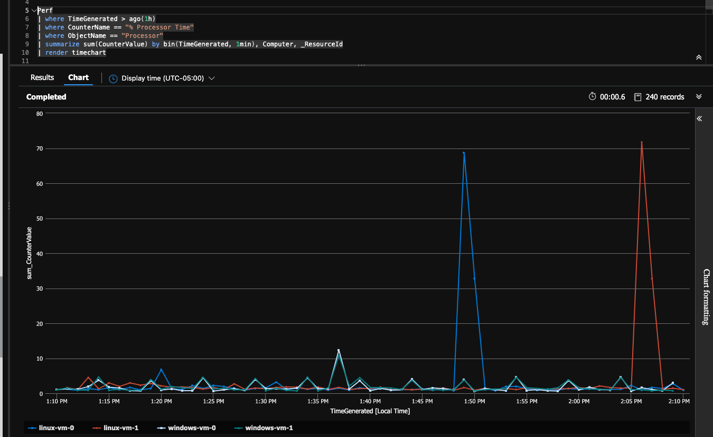

# Introduction

- [Introduction](#introduction)
  - [Prerequisites](#prerequisites)
    - [Azure CLI](#azure-cli)
    - [Terraform](#terraform)
    - [Azure CLI Extensions](#azure-cli-extensions)
    - [Azure Monitor Powershell](#azure-monitor-powershell)
  - [Instructions](#instructions)
    - [Terraform](#terraform-1)
    - [SSH to VM](#ssh-to-vm)
    - [Stress test](#stress-test)
    - [View the CPU Spike](#view-the-cpu-spike)
    - [Useful Commands](#useful-commands)
  - [Unknowns](#unknowns)
    - [References](#references)

## Prerequisites

If on Windows 10 it's recommended to use WSL2 + Ubuntu.

### Azure CLI

- [Install Azure CLI](https://docs.microsoft.com/en-us/cli/azure/install-azure-cli)
- [\[Optional\] Install Azure CLI ML extension](https://docs.microsoft.com/en-us/azure/machine-learning/how-to-configure-cli) by running `az extension add -n azure-cli-ml`

### Terraform

[Install Terraform](https://learn.hashicorp.com/tutorials/terraform/install-cli#install-terraform)

### Azure CLI Extensions

```bash
az extension add --name monitor-control-service
az extension add --name log-analytics
```

### Azure Monitor Powershell

\[Optional\] If you want to call Azure Monitor from Powershell you can install the `Az.Monitor` Cmdlet.

```bash
# In Powershell (type pwsh)
Install-Module Az.Monitor
```

## Instructions

### Terraform

```text
cd deployment
touch dev.tfvars
terraform init
terraform plan --var-file dev.tfvars
terraform apply --auto-approve --var-file dev.tfvars
```

Once applied terraform will output three commands, see the [deployment/output.tf](deployment/outputs.tf) for reference.  Copy and paste each of these commands to the terminal.

Note that the [deployment/variables.tf](deployment/variables.tf) contains defaults for each required variable.  You still need a [deployment/dev.tfvars](./deployment/dev.tfvars) however it can be empty unless you want to override the defaults.

### SSH to VM

```bash
# Replace vmIp with the public IP of the VM
ssh -i ~/.ssh/id_rsa adminuser@vmIp
```

Note: The above ssh command is output as part of terraform output so you can copy and paste from your terminal.  Alternatively to get the ip of the VM use: `az vm list-ip-addresses --name vmName --resource-group ama_test --out table`.

### Stress test

```bash
stress --cpu 2 --timeout 60
```

### View the CPU Spike

First let's verify we can execute a query against the workspace:

```bash
az monitor log-analytics query -w "$(az monitor log-analytics workspace list -g ama_test | jq -r '.[0].customerId')" --analytics-query "Heartbeat | where TimeGenerated > ago(1h) | summarize count() by Computer"
```

You should see something like:

```text
[
  {
    "Computer": "samuel-linux-1",
    "TableName": "PrimaryResult",
    "count_": "57"
  }
]
```

Now let's look at the CPU spike we produced earlier.

```bash
az monitor log-analytics query -w "$(az monitor log-analytics workspace list -g ama_test | jq -r '.[0].customerId')" --analytics-query " Perf | where CounterName == \"% Processor Time\" | where ObjectName == \"Processor\" | summarize avg(CounterValue) by bin(TimeGenerated, 5min), Computer, _ResourceId | render timechart"
```

This will return quite a bit of data, so it's generally recommended to run this in the Azure Portal in the Log Analytics Workspace.  When doing that you'll see:



### Useful Commands

```bash
# Show public key for server
az vm show -g ama_test --name samuel-linux-1 --query "osProfile.linuxConfiguration.ssh.publicKeys[0].keyData"

# Reset public key
az vm user update -g ama_test --name samuel-linux-1 --username azureuser --ssh-key-value ~/.ssh/id_rsa.pub

# See Azure Monitor versions
az vm extension image list --location eastus2 -o table | grep AzureMonitorLinuxAgent
```

## Unknowns

In the [templates/dcr.test.json](./templates/dcr.test.json) an error is thrown "Operation returned an invalid status code 'BadRequest'" if I include the following in the `performanceCOunters.streams`:

```text
  "Microsoft-Syslog",
  "Microsoft-Event",
```

I've seen the Log Analytics workspace deployed to a separate subscription which causes the `az monitor` commands to fail when looking up the workspace.  This may be due to me running in an enterprise sub and not a pay-as-you-go which may be with LA requires.

### References

- [Azure Monitor Agent](https://docs.microsoft.com/en-us/azure/azure-monitor/agents/azure-monitor-agent-overview)
- [DCR Reference](https://docs.microsoft.com/en-us/azure/azure-monitor/agents/data-collection-rule-overview#create-a-dcr)
- [az monitor-control-service](https://github.com/Azure/azure-cli-extensions/blob/main/src/monitor-control-service/README.md)
- [DCR json reference](https://docs.microsoft.com/en-us/rest/api/monitor/data-collection-rules/create#examples)
- [*-AzDataCollection* Command Reference](https://github.com/Azure/azure-powershell/tree/main/src/Monitor/Monitor/help)
- [Terraform Azure Github Examples](https://github.com/hashicorp/terraform-provider-azurerm/tree/main/examples)
- [az monitor log-analytics](https://docs.microsoft.com/en-us/cli/azure/monitor/log-analytics?view=azure-cli-latest)
- [Performance Counters reference](https://docs.microsoft.com/en-us/azure/azure-monitor/agents/data-sources-performance-counters)
